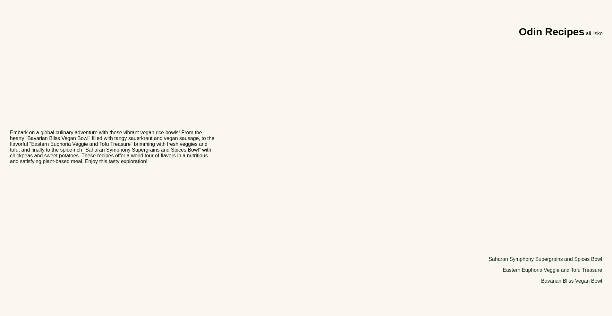

# My "Recipe-Website" project

## Description

This is my first project with "The Odin Project".  
A simple Website made with **HTML** and **CSS**.

## Contents

- a main page with links
- three recipe pages
  - odert and unordert lists
  - img of the dish
- external CSS

## Links

- [live preview](https://bipbopbupdup.github.io/odin-recipes/)
- link to the [Assignment](https://www.theodinproject.com/lessons/foundations-recipes)

## Notes

The recipes are all generated by chat.openai.com and serve only as an example
